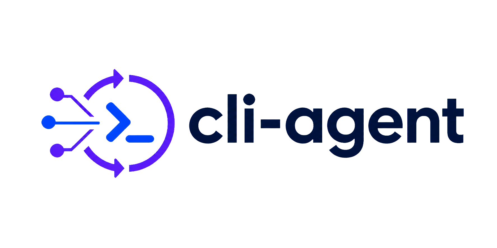
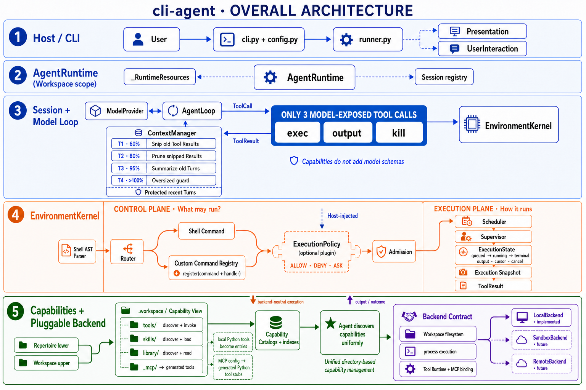

<div align="center">



[English](README.md) · **中文**

</div>

---

`cli-agent` 是一个通过 CLI 操作完成任务的通用 Agent。它绑定到一个
Workspace 目录，检查状态、运行命令和工具，并不断迭代直到任务完成 ——
既支持交互式会话，也支持一次性任务。

**一切皆命令。** 模型只暴露三个 Tool —— `exec` 执行命令，`output` 重新读取
某个 Execution 的保留输出，`kill` 终止它。其余所有操作都通过一套保留命令
语法来表达：文件修改用 `files write` / `files edit`，工具调用用
`tools list` / `tools info` / `tools run`，会话状态用 `cd` 和 `export`。
所有能力（tools / skills / library / MCP）都从统一的目录式 Capability View
中发现 —— Repertoire 为下层、Workspace 为上层，支持 shadowing 与 copy-up
—— 并且不会新增模型 schema，因此无论安装多少能力，三个 Tool 的模型面
始终保持稳定。

## 特色

| 特性 | 说明 |
|---|---|
| **四级上下文压缩** | 长会话始终保持在模型上下文窗口内：过期的 Tool Result 依次被 snipped、pruned，旧轮次被 summarize；Active Turn 与用户指令永不被截断。 |
| **多后端支持** | 与 Provider 无关的模型接口（OpenAI 兼容端点、scripted providers），以及统一 Backend 契约下的可插拔执行后端。 |
| **权限解耦** | `ExecutionPolicy` 是 Host 注入的可选插件，决定 `ALLOW` / `DENY` / `ASK`；用户交互是独立的 Host 通道。所有失败都 fail closed。 |
| **一切皆命令** | 模型面只有三个 Tool（`exec` / `output` / `kill`）；文件、工具和会话状态都是命令，所有能力都从统一的目录式目录中发现。 |
| **并行调度** | 连续的 parallel-safe 命令在并发批次中运行。 |
| **Workspace 作用域环境** | 持久的 `.workspace/env` 快照，加上会话内 export，会话之间互不泄漏。 |

## 架构



cli-agent 从 Host 到 Backend 分层设计：

- **Host / CLI** —— `cli.py`、`config.py` 和 `runner.py` 负责校验配置并呈现
  事件；`UserInteraction` 是 Host 拥有的提问通道。
- **AgentRuntime** —— 一个 Workspace 作用域的 Runtime 拥有多个 Session。
  每个 Session 绑定一个 `ModelProvider` 和 `AgentLoop`；`ContextManager`
  在每次模型请求前运行四级压缩流水线。
- **EnvironmentKernel** —— 将**控制面**（什么可以运行：Host 注入的
  `ExecutionPolicy` → `ALLOW` / `DENY` / `ASK` → Router → Shell AST →
  `ExecutionState`）与**执行面**（如何运行：后端无关的请求 → 可插拔
  Backend → 经由 Capability View 的 Workspace 文件系统）分离。
- **Capabilities** —— 基于目录的 Catalogs 统一暴露 Tools、Skills、Library
  和 MCP 绑定；它们不会新增模型 schema。

## 安装

需要 Python ≥ 3.11 和 [uv](https://docs.astral.sh/uv/)。

### 全局安装 —— 在任何目录下使用 `cli-agent`

```bash
cd cli-agent
./scripts/install.sh            # 可编辑安装 + 一次性配置
# 或手动执行：
uv tool install --editable .    # --editable：跟随本仓库，无需重复安装
```

首次运行会从 `cli-agent.env.example` 生成 `~/.cli-agent/.env`（权限 600）；
只需配置一次 Provider：

```bash
# ~/.cli-agent/.env
CLI_AGENT_MODEL="your-model"
CLI_AGENT_BASE_URL="https://api.example.com/v1"
CLI_AGENT_API_KEY="sk-..."
```

然后就可以从任意目录启动：

```bash
cd ~/some/unrelated/project
cli-agent "检查这个项目"
```

优先级：真实环境变量（direnv/`.envrc`、shell `export`）始终优先于
`~/.cli-agent/.env`。卸载：`uv tool uninstall cli-agent`；
`pipx install .` 效果相同。

### 本地开发（本仓库）

```bash
uv sync
cp .envrc.example .envrc
# 编辑 .envrc：设置 CLI_AGENT_MODEL、CLI_AGENT_BASE_URL、CLI_AGENT_API_KEY。
direnv allow
```

[direnv](https://direnv.net/) 负责加载 Provider 配置并激活 uv 管理的虚拟环境。
任何 OpenAI 兼容端点都可以使用；如果你的模型不在内置注册表中，请设置
`CLI_AGENT_CONTEXT_WINDOW`。

## 使用方法

启动交互式会话 —— 每个非空输入都是同一对话中的新一轮；用 `:q`、`/exit`、EOF
或 `Ctrl+C` 退出：

```bash
cli-agent
```

在交互式输入框首字符键入 `/` 会立即弹出 slash command 候选菜单，无需先按
Tab。首版只提供一个内置命令：

- `/exit` —— 结束当前交互会话，与 `:q` 等效，但不创建 Agent turn。

菜单交互方式：

- 继续输入可以按前缀过滤候选（如 `/e` 只保留 `/exit`）；输入不匹配的字符时
  列表消失，删除字符后候选重新出现。
- Up / Down 在候选之间移动；Tab 把当前候选写入输入框并关闭列表，进程仍等待
  后续输入，只有 Enter 才会提交整个输入框内容。
- Escape 关闭候选列表并保留已输入内容；列表打开时按 Enter 不会隐式应用高亮
  候选，只会提交当前输入框内容。
- `:q` 是既有退出快捷方式，不会出现在候选列表中。

首版不支持命令参数补全、文件路径补全或模型名称补全，未知的 `/...` 输入会
原样作为普通 prompt 发送给 Agent。

一次性运行一个任务：

```bash
cli-agent "检查 Workspace"
```

显式指定 Workspace 和能力 Repertoire：

```bash
cli-agent \
  --workspace ./path/to/workspace \
  --repertoire ./path/to/repertoire
```

- `--workspace` —— Agent 工作的目录（默认：当前目录）。
- `--repertoire` —— 用户维护的能力下层树（默认：`~/.cli-agent/repertoire`）。
