# cli-agent Architecture

Current implementation status: RFC-0012 (Backend Workspace and Capability
View decoupling) is fully implemented. One Runtime-owned `_BackendWorkspace`
owns the execution and filesystem namespace shared by Shell, Files, Tools,
Capability Catalogs, the Library worker, and the Workspace MCP Runtime;
Command Handlers only produce backend-neutral execution requests, and the
Local Backend is the only place that creates Host subprocesses. The diagram
below the "Backend Workspace" section describes the pre-RFC-0012 structure
and is retained for history only.

## Backend Workspace and Capability View decoupling (RFC-0012)

### Ownership and lifecycle

`AgentRuntime` owns exactly one `_BackendWorkspace` (opened by
`_Backend.open_workspace`); every Session Kernel borrows it and keeps only
its own cwd, environment, Scheduler, and Execution Handles. Runtime open
follows the fixed RFC order:

```text
validate Host configuration
  -> open Capability Source / State
  -> Backend.open_workspace (Bound Capability View materialized)
  -> reconcile Workspace MCP projections
  -> reconcile Tool Catalog
  -> reconcile Backend Tool Runtime
  -> reconcile Skill Catalog
  -> reconcile Library Catalog
  -> construct AgentRuntime
  -> start Library background worker
```

Any open failure rolls back every already-opened resource in reverse order
(`_OpenResources`), and no failure ever falls back to a permission-wider
Backend. Runtime close follows the reverse dependency order:

```text
reject new turns
  -> close every EnvironmentKernel (cancels queued/running Executions)
  -> stop the Library worker
  -> flush Backend Workspace (failures are visible to the Host)
  -> close Backend Workspace
  -> close the application state database
```

### Contracts

- `_BackendWorkspace` exposes `root` (a Backend path string, never a Host
  `Path`), `filesystem`, `capabilities`, `mcp`, and the synchronous
  `prepare_shell` / `prepare_tool` factories; `reconcile_tool_runtime`,
  `flush`, and `close` own the Tool Runtime and Workspace lifecycle.
- `_WorkspaceFilesystem` is the async filesystem contract shared by
  Handlers, Catalogs, the Library worker, and Tool Runtime projections;
  writes honor Bound Capability View semantics.
- `_BoundCapabilityView` answers managed-relative-path provenance, shadow,
  whiteout, and validation facts plus `list`/`read`/`stat`; Local
  materialization uses symlink attach and copy-up, but the contract is
  symlink-free (the deterministic Sandbox proof implements it in memory).
- `_ToolRuntimeStatus` distinguishes mandatory open failures (which fail
  closed) from Tool Runtime dependency failures (which only disable
  `tools run`, never fall back to Host Python).
- `_WorkspaceMCPRuntime` performs server discovery inside the Backend and
  materializes the worker-side invocation binding (`mcp_binding.py`) into
  the Backend Tool Runtime; stubs never self-connect or reference env names.

### Consumers

Command Handlers (Shell, Files, Tools, cd) and every Catalog consume only
these contracts: the Shell Handler emits `_ShellExecutionRequest`, the Tool
Handler emits `_ToolExecutionRequest` with logical Tool bindings, the Files
Handler drives the Workspace Filesystem, and `cd` uses Backend-mediated
`filesystem.resolve`. `_ExecutionState`, the Execution Snapshot, the
Scheduler, and the Supervisor contain no Backend discriminator, no
`BackendSession`, and no parallel Workspace owner.

### LocalBackend scope and isolation statement

The Local Backend is the reference RFC-0012 implementation and runs every
process with the Host user's permissions on the Host filesystem: it does
**not** provide OS-level filesystem, network, process, secret, or resource
containment. The deterministic Sandbox proof (a pure in-memory `/sandbox`
namespace implementing the same contracts) demonstrates that Shell writes
are readable by Files, Tools, and every Catalog, and that Files/Tool writes
are visible to later Shell commands, without any Host mirror; a future
Sandbox or Remote provider reuses the same acceptance suite.

```mermaid
flowchart TB
    subgraph HOST["Host 层 · Reference CLI"]
        direction LR

        CLI["cli.py<br/>argparse 入口<br/>退出码"]
        CONFIG["config.py<br/>CliConfig<br/>provider 构建"]
        RUNNER["runner.py<br/>one-shot / 交互循环<br/>Runtime 生命周期"]
        PRES["presentation.py<br/>stdout / stderr<br/>事件与诊断渲染"]
        INTERACTION["Terminal UserInteraction<br/>标准问题 → allow_once / deny"]

        CLI --> CONFIG --> RUNNER
        RUNNER --> PRES
    end

    subgraph RUNTIME["Agent Runtime · cli_agent.runtime"]
        direction TB

        RT["runtime.py<br/>AgentRuntime<br/>open / close · Session registry<br/>owns one resource aggregate"]
        RES["_resources.py<br/>_RuntimeResources<br/>Workspace-lifetime 所有权边界"]
        DIAG["diagnostic.py<br/>RuntimeDiagnostic<br/>结构化、非阻塞 Host 通知"]

        subgraph MODEL_PLANE["Model / Conversation seam"]
            direction LR

            LOOP["_agent_loop.py<br/>AgentLoop<br/>会话历史 · 对话循环<br/>Tool Call 分派"]
            MODEL["model.py<br/>消息 / 事件<br/>ModelProvider 协议"]
            SYSCALLS["_syscalls.py<br/>固定模型面<br/>exec · output · kill"]
            SYSMSG["_system_message.py<br/>Runtime system message<br/>Tools + Skills 紧凑广告"]
            PROVIDER["providers/<br/>OpenAI-compatible / Scripted<br/>httpx 流式 Provider"]

            LOOP -->|generate request| PROVIDER
            PROVIDER -->|ModelEvent 流| LOOP
            MODEL -.->|定义协议| PROVIDER
            SYSCALLS -->|默认 syscall schemas| MODEL
            SYSMSG -->|注入初始历史| LOOP
        end

        subgraph CAP["Capability 域 · Runtime-open / shared"]
            direction TB

            WS["workspace.py<br/>.workspace 引导<br/>dotenv 环境快照"]
            VIEW["view.py<br/>Capability View<br/>tools / skills / library / _mcp<br/>symlink · copy-up · whiteout"]
            PARSER["command_parser.py<br/>tree-sitter Shell AST<br/>不可变语法事实"]

            subgraph TOOLS["tools/"]
                direction LR

                T_FACTS["facts.py<br/>ToolEntry · ToolCommand"]
                T_CAT["catalog.py<br/>可信 Tool Catalog<br/>生成 tools/index.md"]
                T_GRAM["grammar.py<br/>tools list / info / run<br/>命令分类"]
                T_ENV["environment.py<br/>Workspace-private venv<br/>uv pip sync + mcp base dep"]
                T_WORKER["worker.py<br/>stdlib JSON worker"]
            end

            subgraph SKILLS["skills/ · M8"]
                direction LR

                S_FACTS["facts.py<br/>SkillEntry"]
                S_PARSE["parser.py<br/>strictyaml frontmatter<br/>结构校验"]
                S_CAT["catalog.py<br/>Skill Catalog<br/>生成 skills/index.md"]
            end

            subgraph LIB["library/ · 模型摘要索引"]
                direction LR

                L_FACTS["facts.py<br/>LibraryEntry · fingerprint<br/>_directory_fingerprint"]
                L_PARSE["parser.py<br/>LibraryFileParser 协议<br/>.md / .txt UTF-8"]
                L_CACHE["cache.py<br/>_SummaryCache<br/>SQLite library_summary_cache"]
                L_CAT["catalog.py<br/>_LibraryCatalog<br/>状态机 · 串行 worker<br/>reconcile · 级联 · 索引渲染"]
                L_DB["state.sqlite3<br/>library_summary_cache 表"]

                L_FACTS --> L_CAT
                VIEW --> L_PARSE --> L_CAT
                L_CACHE --> L_DB
                L_CAT --> L_CACHE
                L_CAT -->|原子刷新 index.md| VIEW
            end

            subgraph MCP["mcp/ · M13"]
                direction LR

                M_FACTS["facts.py<br/>MCPServerConfig<br/>config.json 校验"]
                M_CAT["catalog.py<br/>full-rebuild reconcile<br/>stdio / http → list_tools<br/>失败重试与诊断"]
                M_STUB[".workspace/tools/mcp_*.py<br/>生成的 MCP Tool stubs"]
            end

            WS --> VIEW
            VIEW --> PARSER

            T_FACTS --> T_CAT
            VIEW --> T_CAT
            T_CAT --> T_GRAM
            VIEW --> T_ENV
            T_ENV --> T_WORKER

            S_FACTS --> S_CAT
            VIEW --> S_PARSE --> S_CAT

            L_FACTS --> L_CAT
            VIEW --> L_PARSE --> L_CAT
            L_CACHE --> L_DB
            L_CAT --> L_CACHE
            L_CAT -->|原子刷新 index.md| VIEW

            M_FACTS --> M_CAT
            VIEW --> M_CAT
            M_CAT -->|生成 / 覆盖| M_STUB
            M_STUB -->|进入普通 Tool Catalog| T_CAT
        end

        subgraph SESSION["每个活跃 Session · lazy-created"]
            direction TB

            SESSION_NODE["Session<br/>恰好拥有一个 AgentLoop<br/>和一个 EnvironmentKernel"]

            subgraph ENV["Environment 域 · Session-scoped"]
                direction TB

                KERNEL["kernel.py<br/>EnvironmentKernel<br/>dispatch_batch · state · close"]

                PROTO["protocol.py<br/>exec / output / kill<br/>参数校验与 Execution snapshot"]
                POLICY["policy.py<br/>ExecutionPolicy（可选）<br/>ALLOW / DENY / ASK"]
                ROUTER["routing.py<br/>resolve(ShellParseResult)<br/>Custom registry + Shell fallback"]
                INVALID["invalid_argument<br/>parse failure 短路<br/>不进入 Router / Policy"]
                SCHED["scheduler.py<br/>single pending queue + barriers<br/>parallel_limit"]
                SUPV["supervisor.py<br/>执行监督<br/>等待 · 取消 · 清理"]
                EXEC["execution_state.py<br/>_ExecutionState<br/>bounded output · Cursor · lifecycle"]
                CMDS["commands.py<br/>Runtime Custom handlers<br/>cd / export"]

                subgraph HANDLERS["handlers/"]
                    direction LR

                    HAND_BASE["base.py<br/>CommandContext + PreparedExecution"]
                    SHELL_HANDLER["shell.py<br/>Shell handler"]
                    TOOL_HANDLER["tools.py<br/>Tool handler"]
                    FILE_HANDLER["files.py<br/>write / edit handler<br/>grammar + facts + handler"]
                    PROC["executions.py<br/>process group<br/>SIGTERM → KILL"]
                end

                KERNEL --> PROTO --> PARSER
                PARSER -->|parse failure| INVALID
                PARSER -->|Parsed Command| ROUTER
                POLICY -.->|可选注入<br/>route 后 admission 前| KERNEL
                POLICY -->|DENY / 异常 / 非法| DENIED["policy_denied<br/>不创建 Execution / 不占用队列"]
                POLICY -->|ASK| INTERACTION
                INTERACTION -->|allow_once| SCHED
                INTERACTION -->|deny / cancel / 非法| DENIED

                ROUTER -.->|查找 Custom registry| CMDS
                ROUTER -->|_ExecutionRoute| SCHED
                SCHED --> SUPV --> HAND_BASE
                HAND_BASE --> SHELL_HANDLER
                HAND_BASE --> TOOL_HANDLER
                HAND_BASE --> FILE_HANDLER
                SHELL_HANDLER --> PROC
                TOOL_HANDLER --> PROC
                FILE_HANDLER -->|prepare_path 写前 copy-up| VIEW
                SUPV --> EXEC
                TOOL_HANDLER -->|启动 JSON worker| T_WORKER
            end

            SESSION_NODE --> LOOP
            SESSION_NODE --> KERNEL
            LOOP -->|dispatch batch ToolCall| KERNEL
            KERNEL -->|有序 ToolResult| LOOP
        end

        RT -->|owns one aggregate| RES
        RES -->|Runtime-open 一次| WS
        RES --> VIEW
        RES --> T_CAT
        RES --> T_ENV
        RES --> S_CAT
        RT -->|首次 run_turn 创建| SESSION_NODE
        SESSION_NODE -.->|borrows explicit objects| RES
        M_CAT -->|发现失败 / 配置无效| DIAG
        DIAG -->|on_diagnostic callback| PRES
    end

    CONFIG -->|build_provider| PROVIDER
    RUNNER -->|provider + user_interaction + callbacks| RT

    classDef host fill:#e8f3ff,stroke:#3978b9,stroke-width:1.5px
    classDef runtime fill:#fff4cf,stroke:#b88a00,stroke-width:1.5px
    classDef capability fill:#e9f7e9,stroke:#4b9b50,stroke-width:1.5px
    classDef skill fill:#f1e8ff,stroke:#7950b8,stroke-width:1.5px
    classDef library fill:#e8f6ee,stroke:#2f8f5b,stroke-width:1.5px
    classDef mcp fill:#ffe9f2,stroke:#c45183,stroke-width:1.5px
    classDef environment fill:#ffe9e7,stroke:#c2554d,stroke-width:1.5px
    classDef adapter fill:#fff0dc,stroke:#bd7a22,stroke-width:1.5px
    classDef boundary fill:#f2f4f7,stroke:#667085,stroke-width:2px
    classDef artifact fill:#f7f7f7,stroke:#8c8c8c,stroke-dasharray:5 3

    class CLI,CONFIG,RUNNER,PRES,INTERACTION host
    class RT,DIAG,SYSMSG,SYSCALLS,MODEL runtime
    class PROVIDER adapter
    class WS,VIEW,PARSER,T_FACTS,T_CAT,T_GRAM,T_ENV,T_WORKER capability
    class S_FACTS,S_PARSE,S_CAT skill
    class M_FACTS,M_CAT mcp
    class M_STUB artifact
    class L_FACTS,L_PARSE,L_CACHE,L_CAT library
    class SESSION_NODE,RES boundary
    class KERNEL,PROTO,POLICY,INVALID,DENIED,ROUTER,SCHED,SUPV,EXEC,CMDS,HAND_BASE,SHELL_HANDLER,TOOL_HANDLER,PROC environment
```



> The diagram above predates RFC-0012: `view.py`, `environment.py`, and the
> Tool worker now live inside the Backend, Handlers no longer hold Host
> `Path` or `_CapabilityView` mechanics, and `tools/index.md` projections are
> written through the Workspace Filesystem. It is retained for history; the
> "Backend Workspace and Capability View decoupling" section is current.

## Library model-generated indexes

The Library is the effective `.workspace/library` Capability View merged from
the user-maintained Repertoire lower tree and the Workspace upper tree. On
Runtime open `_LibraryCatalog.reconcile` discovers source facts, computes
content fingerprints, resolves cached summaries, renders every visible
directory `index.md`, and returns without calling any model; the Runtime then
starts one serial summary worker that owns the queue.

```text
Repertoire lower ─┐
                  ├─> .workspace/library effective view
Workspace upper ──┘                  │
                                     ▼
                          LibraryCatalog.reconcile()
                           │        │          │
                           │        │          └─> 渲染 index.md（不含模型）
                           │        └─> 查询 SQLite 缓存
                           └─> 提交 pending 任务
                                         │
                                         ▼
                             Runtime-owned 串行 worker
                                │        │
                                │        └─> 目录摘要（自底向上）
                                └─> file parser -> 模型摘要
                                         │
                                         ▼
                             SQLite upsert + 原子索引刷新
```

### 应用状态数据库与摘要缓存

`~/.cli-agent/state.sqlite3` 是 cli-agent 的本地应用状态数据库
（`_state_db.py`，`PRAGMA user_version` 显式 migration，短事务 +
`busy_timeout`）。Library 首期只使用 `library_summary_cache` 表，缓存键是
包含对象类型域分隔的 fingerprint；只有成功摘要落库，原文、parser 正文、
pending job 和凭证绝不入库。删除该表或数据库只会丢失派生摘要、触发重新生成；
未来引入 Session History 等非派生应用状态后，不得再把删除整个
`state.sqlite3` 描述为无损操作。

### File Parser 范围

`parser.py` 定义 `LibraryFileParser` 协议（`supports` / `parse`），首期
registry 只有一个 UTF-8 text parser，只声明支持 `.md` 和 `.txt`。Parser
只返回供摘要模型的完整规范化文本，不承担摘要、缓存或索引渲染职责；后续
PDF/PPT 等格式通过新增 parser 实现接入，不改变 Catalog、缓存或 renderer。

### 状态语义与后台生命周期

每个条目公开五种状态：`ready`（当前摘要）、`pending`（无摘要、已排队或执行
中）、`stale`（Runtime 观察到 source 变化，保留显式过期摘要并排队刷新）、
`failed`（最近一次生成失败，`error` 保存有界原因）、`unsupported`（没有
parser 支持）。只有 `ready` 摘要可视为当前摘要。文件摘要完成后，目录只在其
直接子项全部达到终态时按深度自底向上排队；每次终态转换都会级联重新评估全部
祖先目录。Runtime close 取消 worker；已提交 SQLite 的摘要保留，未完成任务在
下一次 open 重新发现为 `pending`。

### 失效检测与 reconcile 时机

Runtime `files write` / `files edit` 成功修改 Library 后，精确路径立即进入
Catalog 内部 `dirty_paths` 集合（失败操作不标记）。每次普通 Agent 模型请求
前，AgentLoop 通过 Kernel 触发 `reconcile_changes`：dirty 路径强制重读，其他
路径比较成员关系、`mtime_ns` 与 size，变化路径重新计算 fingerprint 并迁移为
`pending` 或 `stale`，删除条目立即移除，随后失效祖先目录并排队，全程不调用
模型、不等待摘要。内部摘要请求直接调用 provider，不递归触发该 hook。不使用
文件 watcher，也没有任何 `library` 命令。

## Unified command execution

The model-visible surface remains the fixed `exec`, `output`, and `kill`
syscalls. An `exec` call follows one Session lifecycle:

```text
exec(raw command)
    -> parse_shell_ast
       -> parse failure: invalid_argument ToolResult
    -> Router.resolve(parsed command) -> _ExecutionRoute
    -> optional ExecutionPolicy.evaluate(parsed command)
       -> ALLOW: continue
       -> DENY: policy_denied ToolResult
       -> ASK: UserInteraction.ask(standard question)
          -> allow_once: continue
          -> deny / cancel / invalid / failure: policy_denied ToolResult
    -> Supervisor.admit(parsed command, route)
    -> Scheduler -> Execution
    -> backend-neutral Execution Snapshot
```

Router runs before any Policy and only selects the Command and the
Runtime-trusted `parallel_safe` fact. Policy is an optional Host plugin:
`execution_policy=None` fully skips evaluation and constructs no implicit
decision. `user_interaction` is a required, Host-owned `AgentRuntime.open`
dependency even when Policy is absent; Runtime close only cancels pending
asks and never closes the interaction. The current design assumes one
Runtime serves one Session at a time.

`cd` and `export` are registered Custom commands with mutable Session context.
The `tools` command is another Custom command; its Tool grammar and Catalog
remain inside the capability handler. The `files` command is a Custom command
whose grammar, facts, and write/edit handler live together in
`handlers/files.py`, with the injected Capability View prepared before each
mutation. Unmatched commands use the Shell
handler. Command metadata controls isolation: `isolated=True` copies the
Session environment and removes `set_cwd`, while `parallel_safe=True` always
gets the same snapshot even when the command is otherwise serial.

The Scheduler has one `parallel_limit` and no Tool-specific lane. Consecutive
parallel-safe commands share a batch, a serial command creates a barrier, and
later work cannot cross that barrier. Every admitted command therefore shares
the same output, cursor, cancellation, close, and Session-private Handle
contract regardless of its handler.

## Session Context Management

Each Session owns one `_ContextManager` (with `_ContextLedger`,
`_TokenMeter`, `_ToolResultReducer`, and `_ContextSummarizer`) as the single
owner of conversation history, revisions, usage anchors, and compaction state.
`AgentLoop` only orchestrates: append, prepare, generate, observe, dispatch.

```text
append(UserMessage)
        |
        v
prepare_request() ----> Provider.generate(normal request)
                              |
                              v
                        observe(usage)
                              |
                              v
                    append(AssistantMessage)
                              |
                 +------------+------------+
                 |                         |
             no ToolCall                 ToolCall
                 |                         |
             Turn ends              dispatch tools
                                           |
                                           v
                                append(ToolResultMessage)
                                           |
                                           v
                                  prepare_request()
```

The input budget is `context_window - output_reserve - safety_margin` from the
Host-supplied `ContextPolicy` (the Reference CLI resolves the model's maximum
window from a built-in registry, overridable via `CLI_AGENT_CONTEXT_WINDOW`).
Before each normal request the manager projects input tokens and runs the
four tiers in order; pressure is re-measured after each tier, so an initial
95% pressure does not unconditionally call the summarizer:

| Tier | Trigger | Target | Action |
|---|---|---|---|
| Snip | 60% | 55% | bounded head/tail placeholder for the oldest stale success Tool Results outside the Protected Suffix |
| Prune | 80% | 70% | snipped results reduced to identification + reclaimed marker |
| Summarize | 95% | 55% | oldest completed turns merged into a no-tools summary |
| Oversized guard | >100% | budget | newest re-readable result compacted; unrecoverable input fails closed |

The Protected Suffix always includes the Active Turn and the most recent
complete turns, expanded to complete User Turn boundaries. Tool Exchanges are
atomic: Assistant Tool Calls and their `ToolResultMessage` stay paired by
`call_id` sets, and compaction never deletes or splits them. Result states are
monotonic (`raw -> snipped -> pruned -> summarized`) and repeated prepares are
idempotent; each actual modification must reclaim at least
`minimum_reclaim_tokens` unless recovering from overflow.

Usage anchors: after each completion the manager records the Provider-reported
`input_tokens` against the sent request revision. Later projections are the
anchor plus a conservative estimate of appended deltas, labeled `estimated`;
`total_tokens` is never used as the next input watermark. The estimator is
deterministic (CJK characters count as one token, other text as a quarter
token, plus message and Tool schema overhead) and is pinned by tests; a
Provider count hook can replace it later without changing Runtime semantics.

Tier 3 uses a restricted `_ContextSummarizer`: `ModelRequest(..., tools=())`,
consumes Text Deltas internally, and fails atomically on Tool Calls, missing
completions, exceptions, or overflow. The prompt fixes the four sections
`## Progress` / `## Files` / `## Todo` / `## Context`, treats the transcript as
untrusted data, and merges the old summary with new completed turns. On success
the summary is committed as a delimited Assistant Message after the System
Message (never promoted to a System role), the consumed turns are deleted, and
the Summary Frontier advances; on any failure nothing changes.

Provider-reported Context Overflow (`ModelContextOverflowError`) enters a
recovery path: the usage anchor is invalidated, all deterministic tiers and,
when a complete prefix exists, Tier 3 run with `reason=overflow_recovery`, the
hard budget is re-checked, and the same model step is retried exactly once.
Recovery never repeats Tool dispatch (it happens before any Completion), a
second overflow or unrecoverable input raises a stable error, and the Session
stays closable.

Compaction is observable through the Host `RuntimeDiagnostic` callback with
kinds `context.snipped`, `context.pruned`, `context.summarized`,
`context.oversized_result`, `context.overflow_recovery`, and
`context.compaction_failed`. Diagnostics carry only session ID, revisions,
tier, usage source, before/after projected tokens, changed entries, summarized
turns, and the trigger reason - never message bodies, Tool payloads, summary
text, commands, environment values, or Secrets.
