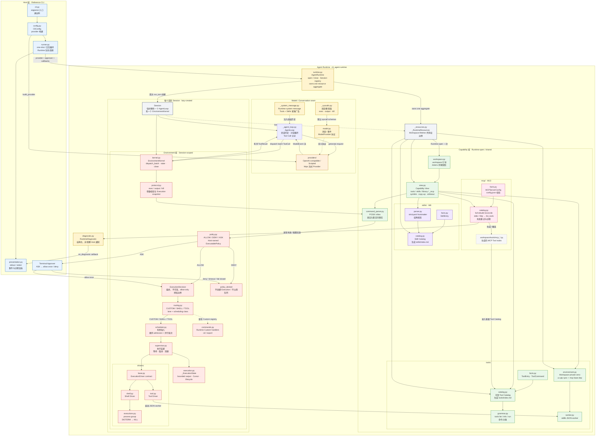

# cli-agent Architecture

Current implementation status: M15 explicit Runtime resource ownership is
implemented. The next milestone is M14, which will replace direct MCP worker
connections with bounded IPC bindings.

