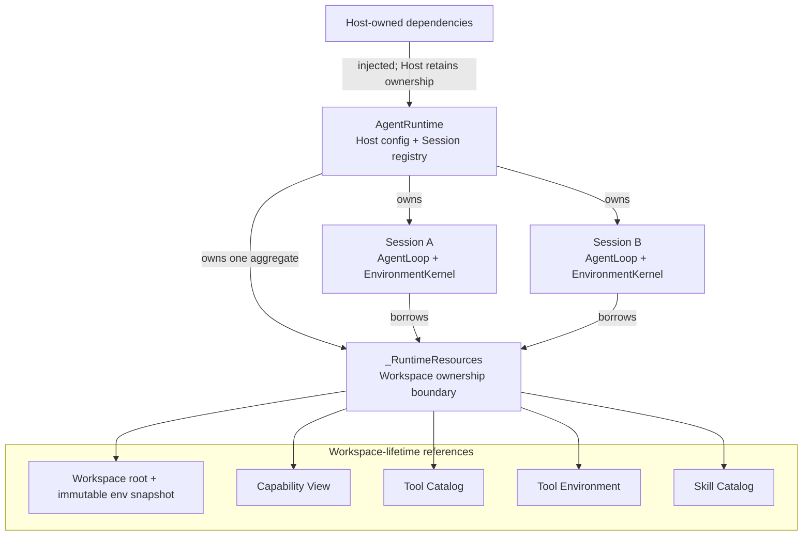

# RFC-0006: Runtime Workspace 资源显式所有权

## 概述

本 RFC 提议新增私有的 `_RuntimeResources`，集中表达一个已打开
`AgentRuntime` 所拥有并由全部 Session 共享的 Workspace-lifetime 对象。该类型
是一个引用稳定的纯数据聚合：它保存 Workspace root、Workspace environment
快照、Capability View、Tool Catalog、Tool Environment 与 Skill Catalog；现有
reconciliation 顺序由同模块的 `_reconcile_runtime_resources()` 组装。

`AgentRuntime` 继续拥有 Session registry、Host configuration 和 Session
关闭流程，但不再平行保存每个 Workspace-open 产物。`EnvironmentKernel` 与
system message assembler 只借用 `_RuntimeResources` 中的对象，不取得其所有权。
Host 注入的 `ModelProvider`、`ExecutionPolicy`、`ExecutionApprover` 与诊断回调
仍由 Host 所有，不进入 `_RuntimeResources`。

当前 Workspace-open 产物没有显式 close 契约，因此本 RFC 不新增 resource
manager、`close()` 协议、清理栈或通用组件框架。持久 `.workspace` 状态仍由各
reconciler 以现有幂等和原子写语义维护，Runtime close 仍只需终止 Session-owned
执行状态。

## 背景与上下文

### 当前状态

`AgentRuntime._reconcile` 当前按固定顺序执行：

```text
prepare Workspace
  → load Workspace environment
  → open Capability View
  → reconcile MCP projections
  → reconcile Tool Catalog
  → reconcile Tool Environment
  → reconcile Skill Catalog
  → construct AgentRuntime
```

这些步骤的结果分别作为 `workspace`、`capability_view`、`tool_catalog`、
`tool_environment`、`skill_catalog`、`mcp_catalog` 与 `base_env` 传给
`AgentRuntime.__init__`。Runtime 随后以同等数量的私有字段保存结果，并在创建
Session 时逐项传给 `EnvironmentKernel` 或 system message assembler。

当前 `AgentRuntime.close()` 关闭全部 Session Kernel。Capability View、Catalog
与 Tool Environment 是 Runtime-open 期间建立的共享对象或持久状态描述，没有
独立 close 操作；关闭 Session 后不需要额外异步清理。

### 已验证事实

- `AgentRuntime.__init__` 当前接收 14 个关键字参数，其中 7 个来自 Workspace
  reconciliation。
- `AgentRuntime._reconcile` 手工保存每个中间结果，再逐项转发给构造函数。
- `_new_kernel()` 再次逐项选择 Capability View、Tool Catalog、Tool Environment
  与 base environment。
- system message assembly 使用 Workspace root、Tool Catalog 与 Skill Catalog。
- Capability Catalog 和 Tool Environment 在 Runtime open 调和一次，随后由全部
  Session 共享。
- 每个 Session 独占一个 `AgentLoop` 与 `EnvironmentKernel`；Session Kernel
  拥有 cwd、environment copy、Scheduler、Execution registry 与 Driver
  lifecycle。
- `_MCPCatalog.reconcile()` 的运行结果目前不参与 Session 构造或 Runtime 行为；
  有效投影已经通过生成 Tool 文件进入后续 `_ToolCatalog.reconcile()`。

### 术语表

| 术语 | 定义 |
|---|---|
| Runtime resource | Runtime open 时建立、在 Runtime lifetime 内保留并由 Session 借用的对象或快照。 |
| Workspace lifetime | 从一个 `AgentRuntime` 成功打开到其关闭；同一 Runtime 的全部 Session 共享。 |
| Session lifetime | 从 Session 首次创建到 `close_session` 或 Runtime close。 |
| Owner | 决定对象 lifetime，并负责在 lifetime 结束时执行其现有清理契约的组件。 |
| Borrower | 在 owner 有效期内使用对象，但不延长 lifetime、不替换对象、也不负责关闭的组件。 |
| Reconciliation | Runtime open 时校验并对齐 Workspace 持久状态、Catalog 和环境描述。 |
| Resource aggregate | 以显式字段组合相关对象的 typed data container，不提供动态查找或插件注册。 |

## 问题陈述

### 问题

当前代码能够表达 Runtime 使用哪些 Workspace 对象，但 ownership boundary 只隐含
在 `AgentRuntime` 的一组平行字段中。Workspace reconciliation、Session registry
和 Host configuration 都由同一个 facade 直接保存，导致生命周期分组只能从字段
用途推断。

具体问题包括：

1. Workspace 资源没有一个可命名、可注解、可单独测试的所有权边界。
2. `AgentRuntime.__init__` 和 `_new_kernel()` 需要了解每个 Capability 组件，参数
   和字段会随现有 capability 类型增加而扩张。
3. 测试需要访问多个 Runtime 私有字段，才能证明 Session 是否共享同一份
   Workspace-open 状态。
4. Host-owned dependency 与 Runtime-owned Workspace resource 由相邻字段表达，
   类型结构没有体现 owner 不同。
5. `_mcp_catalog` 被保存在 Runtime 中，但当前行为只依赖它已经生成的 Tool 文件；
   保存无消费者的 reconciliation result 增加了状态面。

### 不作为的影响

- 每增加一种 Workspace-open Catalog 或环境描述，都要同步修改 Runtime
  constructor、字段初始化和若干调用点。
- Runtime facade 同时充当 Session manager 与 Workspace resource bag，代码审查
  需要逐字段判断 lifetime。
- Session 与 Workspace 的共享关系主要依赖文档和测试约定，不能从一个聚合类型
  直接识别。
- 无消费者的 open-time 结果可能继续被保存，只因为既有 constructor 已有对应
  字段。

## 目标与非目标

### 目标

1. 用一个私有 typed aggregate 明确列出当前 Runtime-owned Workspace resource。
2. 让 `AgentRuntime` 只保存一个 Workspace resource 字段，同时继续独立拥有
   Session registry 与 Host configuration。
3. 让 Session Kernel 和 system message assembly 通过显式字段借用共享对象。
4. 把现有 reconciliation orchestration 从 Runtime facade 移到专门的模块级函数。
5. 删除没有 Runtime 消费者的 `_mcp_catalog` 持久字段，同时保留 MCP projection
   reconciliation 行为。
6. 保持 `_environment → _capability` 的单向依赖约束。
7. 不改变模型可见的 `exec`、`output`、`kill` Syscall surface。
8. 不改变 `AgentRuntime.open`、`run_turn`、`close_session` 与 `close` 的 Host
   调用形态。

### 非目标

1. 不引入通用 resource manager、组件 registry 或生命周期依赖图。
2. 不为当前没有 close 契约的 Workspace resource 添加空 `close()` 方法。
3. 不把 Session、Execution 或 Agent conversation state 放入
   `_RuntimeResources`。
4. 不让 Runtime 自动关闭 Host 注入的 Provider、Policy、Approver 或回调。
5. 不改变 Capability View、Catalog、Tool Environment 或 MCP projection 的业务
   语义。
6. 不把 Runtime open 变成文件系统事务，也不回滚已经完成的持久写入。
7. 不引入 Capability 热重载或 Runtime 运行期间的 resource replacement。
8. 不解决同一 Session 的并发 Turn 所有权。

### 成功标准

- [ ] `AgentRuntime` 只通过一个 `_RuntimeResources` 字段访问 Workspace-open
  产物，不再保存对应的平行字段。
- [ ] `_RuntimeResources` 只包含当前有 Runtime 消费者的对象。
- [ ] `_reconcile_runtime_resources()` 保持现有 reconciliation 顺序和失败语义。
- [ ] 全部 Session 借用同一个 Capability View、Tool Catalog、Tool Environment
  与 immutable base environment snapshot。
- [ ] `close_session()` 和 Runtime close 不对 `_RuntimeResources` 执行虚构的
  cleanup。
- [ ] Host-owned dependency 不进入 `_RuntimeResources`。
- [ ] `_RuntimeResources` 不从 `cli_agent.runtime` 公共表面导出。
- [ ] 完整测试、Ruff 与项目采用的类型检查门禁通过。

## 评估标准

采用 1–5 分制，5 表示对该标准的满足程度最高。评分用于同一组当前需求下的相对
比较，不代表性能测量。权重在分析选项前固定。

| 标准 | 权重 | 衡量方式 | 最低阈值 |
|---|---:|---|---:|
| 所有权清晰度 | 30% | 是否能从类型直接识别 Workspace owner、lifetime 与 borrower | 4 |
| Runtime facade 内聚度 | 20% | Workspace composition 是否与 Session registry、Host configuration 分离 | 4 |
| 实现简洁度 | 20% | 新增类型、协议、控制流与无行为方法的数量 | 4 |
| 可测试性 | 15% | 是否可直接断言 resource composition、Session sharing 与边界约束 | 4 |
| 依赖方向 | 10% | 是否保持 Runtime root 组合、`_environment → _capability` 单向依赖 | 4 |
| 公共表面稳定性 | 5% | 是否保持 Host API 与模型 Syscall surface | 4 |

## 方案分析

### 方案一：保持 AgentRuntime 逐字段所有权

**描述**

保留当前实现。Workspace reconciliation 继续位于
`AgentRuntime._reconcile()`，所有结果继续作为独立 constructor 参数和 Runtime
字段保存；通过文档和测试说明哪些字段是 Workspace-lifetime。

**优点**

- 不增加新类型或模块。
- 当前字段访问最短，调用方无需经过 aggregate。
- 不产生迁移改动或测试重排。
- 对当前有限的 capability 数量而言，运行行为已经正确。

**缺点**

- ownership boundary 仍分散在多个字段中。
- Runtime facade 继续同时组合 Workspace 与管理 Session。
- 新 Workspace resource 要修改 constructor、初始化与使用点。
- 无消费者的 open-time result 容易因既有字段而继续保留。
- 测试必须了解多个内部字段才能验证共享关系。

**按标准评估**

| 标准 | 评分 | 说明 |
|---|---:|---|
| 所有权清晰度 | 2 | lifetime 依赖字段用途和文档推断。 |
| Runtime facade 内聚度 | 2 | Workspace composition 与 Session registry 保持在同一类中。 |
| 实现简洁度 | 5 | 不新增实现。 |
| 可测试性 | 3 | 行为可测，但共享边界需要逐字段断言。 |
| 依赖方向 | 4 | 当前依赖方向正确。 |
| 公共表面稳定性 | 5 | 没有公共变化。 |

**加权总分：3.10 / 5.00**

**工作量**：XS，无代码变更。

**风险**

| 风险 | 可能性 | 影响 | 缓解 |
|---|---|---|---|
| constructor 随 capability 增长 | 中 | 中 | 通过 review 限制字段增加。 |
| owner 语义继续依赖文档 | 高 | 低 | 扩充架构文档和白盒测试。 |
| 无消费者字段被保留 | 中 | 低 | 定期做 private state audit。 |

### 方案二：纯数据 `_RuntimeResources` 聚合

**描述**

新增 `runtime/_resources.py`，定义 frozen、slotted 的 `_RuntimeResources`
dataclass，以及模块级异步函数 `_reconcile_runtime_resources()`。dataclass 只保存
当前被 Runtime 或 Session 消费的 Workspace-lifetime 对象；函数按现有顺序调用
各 reconciler 并返回完整 aggregate。

`AgentRuntime` 保存一个 `self._resources`，不再保存对应平行字段。Session Kernel
和 system message assembly 通过显式字段借用对象。`_RuntimeResources` 不实现
`close()`、动态 lookup、registration 或业务行为。

**优点**

- ownership boundary 由一个 typed aggregate 明确表达。
- Runtime facade 可以聚焦 Host configuration、Session registry 和公开生命周期。
- dataclass 字段是静态、可搜索、可类型检查的，不需要字符串 registry。
- 模块级函数集中 reconciliation 顺序，同时避免给数据容器增加复杂 classmethod。
- 可以删除没有 Runtime 消费者的 `_mcp_catalog` 字段。
- 不为空闲的生命周期能力引入协议或状态机。

**缺点**

- 增加一个私有模块和一个 dataclass。
- 字段访问多一层 `self._resources`。
- aggregate 同时引用 Catalog snapshot 和带有内部协调状态的 Capability View，
  “frozen”只约束字段重新绑定，不代表递归不可变。
- `_resources.py` 会成为固定 reconciliation 顺序的 composition root，需要防止
  吸收组件业务逻辑。

**按标准评估**

| 标准 | 评分 | 说明 |
|---|---:|---|
| 所有权清晰度 | 5 | 一个类型列出当前 Workspace owner 持有的全部引用。 |
| Runtime facade 内聚度 | 5 | Workspace composition 从 Session registry 中分离。 |
| 实现简洁度 | 4 | 仅新增 dataclass 和模块级 reconcile 函数。 |
| 可测试性 | 5 | aggregate 内容和 Session sharing 可直接断言。 |
| 依赖方向 | 5 | Runtime root 组合 Capability，Capability 不反向依赖。 |
| 公共表面稳定性 | 5 | 变化仅限私有实现。 |

**加权总分：4.80 / 5.00**

**工作量**：S，约 1–3 个开发日。

**风险**

| 风险 | 可能性 | 影响 | 缓解 |
|---|---|---|---|
| aggregate 退化为 Service Locator | 中 | 中 | 只允许 typed fields，不提供动态查找。 |
| composition module 吸收业务逻辑 | 中 | 中 | 只允许顺序编排；校验和行为留在原组件。 |
| frozen 被误解为深度不可变 | 中 | 低 | 文档明确它只保证引用稳定。 |
| Host dependency 被误放入 resources | 低 | 中 | 所有权矩阵和负向测试固定边界。 |

### 方案三：通用 Runtime resource manager

**描述**

定义统一 `_RuntimeResource` 协议或 registry。每个 Workspace 组件提供 open、close、
依赖声明和导出值；manager 负责排序、创建、查找和关闭。现有 Catalog、Capability
View 与 Tool Environment 都通过 adapter 接入。

**优点**

- owner 和组件顺序可以统一建模。
- 如果将来出现大量可选组件，可复用同一 registration 机制。
- manager 可以统一记录组件打开耗时和失败诊断。
- 可以集中提供 close 和失败补偿扩展点。

**缺点**

- 当前 Workspace resource 没有 close 契约，统一 close 主要产生空方法或 adapter。
- 需要协议、registry、依赖排序、动态 output lookup 和组件状态管理。
- 动态 lookup 弱化 dataclass 字段提供的静态类型信息。
- 现有直接 reconciliation 调用必须包装为统一组件接口。
- 测试面会增加 registry、排序、循环依赖和 manager 状态机，而当前需求只要求
  ownership grouping。

**按标准评估**

| 标准 | 评分 | 说明 |
|---|---:|---|
| 所有权清晰度 | 5 | manager 可统一表达 owner 和组件。 |
| Runtime facade 内聚度 | 5 | composition 完全移出 Runtime facade。 |
| 实现简洁度 | 2 | 引入多项当前没有行为需求的抽象。 |
| 可测试性 | 4 | manager 可独立测试，但附带较大的框架测试面。 |
| 依赖方向 | 4 | 可以保持单向，但 adapter 和 registry 增加间接依赖。 |
| 公共表面稳定性 | 5 | 可以保持私有。 |

**加权总分：4.15 / 5.00**

**工作量**：M，约 1–2 周。

**风险**

| 风险 | 可能性 | 影响 | 缓解 |
|---|---|---|---|
| 为当前不存在的生命周期行为过度抽象 | 高 | 中 | 推迟到至少两个组件需要同类 close 语义时再评估。 |
| 类型安全因动态 registry 退化 | 中 | 中 | 为每种 output 增加 typed accessor。 |
| 迁移影响全部 reconciler | 高 | 中 | 分阶段增加 adapter。 |

### 方案比较

| 标准 | 权重 | 逐字段所有权 | 纯数据 aggregate | 通用 resource manager |
|---|---:|---:|---:|---:|
| 所有权清晰度 | 30% | 2 | 5 | 5 |
| Runtime facade 内聚度 | 20% | 2 | 5 | 5 |
| 实现简洁度 | 20% | 5 | 4 | 2 |
| 可测试性 | 15% | 3 | 5 | 4 |
| 依赖方向 | 10% | 4 | 5 | 4 |
| 公共表面稳定性 | 5% | 5 | 5 | 5 |
| **加权总分** | **100%** | **3.10** | **4.80** | **4.15** |

## 建议

采用方案二：纯数据 `_RuntimeResources` 聚合。

该方案达到全部最低阈值。与方案一相比，它用一个静态类型表达 Workspace ownership
boundary，并从 Runtime facade 中移出固定 reconciliation 顺序；与方案三相比，
它不为当前没有 close 行为的组件创造统一生命周期协议。

### 接受的取舍

1. **增加一层字段访问**：以 `self._resources.tool_catalog` 换取明确的 resource
   grouping。
2. **aggregate 不是深度不可变**：frozen dataclass 保证引用不被替换；
   Capability View 的内部 lock 和协调状态仍由其自身封装。
3. **reconciliation 仍是固定顺序**：当前依赖链是线性的，直接函数调用比动态
   registry 更易审查。
4. **不保存无消费者的结果**：MCP projection 仍执行，但其返回对象不进入
   Runtime state；行为通过生成文件和后续 Tool Catalog 体现。

### 约束

- `_RuntimeResources` 是私有类型，不从 `cli_agent.runtime` 导出。
- `_RuntimeResources` 只提供 typed fields，不提供字符串 lookup 或 registration。
- `_RuntimeResources` 不实现 `close()`；当前清理责任仍全部位于 Session owner 或
  各 reconciler 的局部上下文中。
- `_reconcile_runtime_resources()` 只做 orchestration，不复制各组件的校验、诊断
  或文件写入逻辑。
- Host-owned dependency 不进入 resource aggregate。
- Session 不得替换或关闭 shared Workspace resource。

## 技术设计

### 架构



### 所有权矩阵

| 对象 | 创建方 | Owner | Lifetime | 结束行为 |
|---|---|---|---|---|
| Workspace root | Runtime open | `_RuntimeResources` | Runtime | 释放 Path 引用；不删除目录 |
| base environment snapshot | Runtime open | `_RuntimeResources` | Runtime | 释放 immutable mapping；不修改 env 文件 |
| `_CapabilityView` | Runtime open | `_RuntimeResources` | Runtime | 无 close；保留持久 Overlay 状态 |
| `_ToolCatalog` | Runtime open | `_RuntimeResources` | Runtime snapshot | 无 close |
| `_ToolEnvironment` | Runtime open | `_RuntimeResources` | Runtime snapshot + persistent venv | 无 close；不删除 venv |
| `_SkillCatalog` | Runtime open | `_RuntimeResources` | Runtime snapshot | 无 close |
| MCP projection result | Runtime open | 不保留 | reconciliation call | 生成文件由 Tool Catalog 扫描；返回对象可释放 |
| `_Session` | `AgentRuntime` | `AgentRuntime` registry | Session | 关闭 Kernel 并释放 conversation state |
| `AgentLoop` / `EnvironmentKernel` | Session creation | `_Session` | Session | `close_session` 或 Runtime close |
| `ModelProvider` | Host | Host | Host-defined | Runtime 不关闭 |
| `ExecutionPolicy` / Approver | Host | Host | Host-defined | Runtime 不关闭；Kernel 取消自己的 pending approval task |
| Diagnostic callback | Host | Host | Host-defined | Runtime 不关闭 |

### 模块位置与依赖

新增文件：

```text
src/cli_agent/runtime/
├── runtime.py       # AgentRuntime、Session registry、Host lifecycle
├── _resources.py    # typed aggregate + reconciliation composition
├── _capability/     # Workspace resource implementations
└── _environment/    # Session execution machinery
```

目标依赖方向：

```text
runtime.py → _resources.py → _capability/*
     │              │
     └──────────────┴───── references passed to _environment

_capability/*  -X→  _resources.py
_capability/*  -X→  _environment/*
```

`_resources.py` 位于 Runtime root，因为它是 composition module，而不是新的
Capability domain。Capability 实现不得反向导入 aggregate；Environment 也不接收
整个 aggregate，只接收其实际需要的显式对象，避免把 aggregate 变成跨层 Service
Locator。

### `_RuntimeResources` 数据模型

以下代码表达目标接口，不是逐行实现要求：

```python
@dataclass(frozen=True, slots=True)
class _RuntimeResources:
    workspace: Path
    base_env: Mapping[str, str] = field(repr=False)
    capability_view: _CapabilityView
    tool_catalog: _ToolCatalog
    tool_environment: _ToolEnvironment
    skill_catalog: _SkillCatalog
```

`base_env` 已由 `_load_workspace_env()` 返回 `MappingProxyType`，Session Kernel 在
构造时复制为独立 mutable dict。把该字段设为 `repr=False` 可避免调试输出意外
包含 Workspace environment value。

`frozen=True` 只阻止 aggregate 字段重新绑定。`_CapabilityView` 内部仍持有
mutation lock，`_ToolEnvironment` 描述的 venv 仍是持久可变目录；这些组件继续
封装各自状态。

### reconciliation 函数

模块级函数保持输入和责任最小：

```python
async def _reconcile_runtime_resources(
    *,
    workspace: str | Path,
    repertoire: str | Path | None,
    on_diagnostic: Callable[[RuntimeDiagnostic], None] | None,
) -> _RuntimeResources:
    paths = _prepare_workspace(workspace)
    base_env = _load_workspace_env(paths.environment)
    capability_view = _CapabilityView.open(paths.root, repertoire)
    await _MCPCatalog.reconcile(
        capability_view,
        on_diagnostic=on_diagnostic,
    )
    tool_catalog = _ToolCatalog.reconcile(capability_view)
    tool_environment = await _ToolEnvironment.reconcile(capability_view)
    skill_catalog = _SkillCatalog.reconcile(capability_view)
    return _RuntimeResources(
        workspace=paths.root,
        base_env=base_env,
        capability_view=capability_view,
        tool_catalog=tool_catalog,
        tool_environment=tool_environment,
        skill_catalog=skill_catalog,
    )
```

该函数只移动现有顺序，不改变失败策略：

- Workspace、Capability View 与 Catalog 的结构错误继续使 Runtime open 失败；
- MCP config 或 discovery 的已定义 fail-soft 行为保持不变；
- Tool Environment dependency sync 继续返回 available 或 fail-soft unavailable
  state；
- 已完成的持久写入不会因后续步骤失败而回滚；
- 每个 reconciler 继续负责自己的临时文件和局部上下文。

### AgentRuntime 集成

`AgentRuntime._reconcile()` 调用 `_reconcile_runtime_resources()`，再把返回对象作为
一个 constructor 参数传入。Runtime 保留以下非 Resource 状态：

- Host-owned Provider、Policy、Approver gate 与 diagnostic callback；
- parallel command / Tool configuration；
- Host system instruction；
- Session registry 与 Runtime closed flag。

创建 Session 时：

```text
system message
  ← resources.workspace
  ← resources.tool_catalog
  ← resources.skill_catalog

EnvironmentKernel
  ← resources.workspace
  ← resources.capability_view
  ← resources.tool_catalog
  ← resources.tool_environment
  ← resources.base_env
```

Kernel 接收实际依赖，不接收完整 `_RuntimeResources`，因此 Session machinery 不会
反向依赖 Runtime composition type。

### 关闭语义

关闭顺序保持当前行为：

```text
mark AgentRuntime closed
  → detach Session registry
  → close every Session Kernel
```

`_RuntimeResources` 没有 close 方法。其成员不存在 Runtime-lifetime close contract：

- Catalog 和 environment mapping 是内存快照；
- Capability View 的 asyncio lock 不要求显式释放；
- Tool Environment venv 与生成 index 是持久 Workspace state；
- Workspace path 只是值对象。

Runtime close 后 aggregate 随 Runtime 对象一起等待 Python 回收。若 Host 仍持有已
关闭 Runtime 以检查 `closed`，这些轻量引用可以继续存在；所有模型和执行入口已由
`_ensure_open()` 拒绝。

### 测试设计

新增或调整以下测试：

1. `tests/test_runtime_resources.py`
   - reconciliation 返回完整 `_RuntimeResources`；
   - base environment 是不可变 snapshot 且不出现在 repr；
   - MCP projection 发生在 Tool Catalog reconcile 之前；
   - Tool Environment fail-soft 状态仍进入 aggregate；
   - reconciliation failure 语义与当前行为一致。
2. `tests/test_agent_runtime.py`
   - Runtime 只保存一个 resource aggregate；
   - 两个 Session 借用相同 Catalog、Capability View 与 Tool Environment；
   - 每个 Kernel 获得独立 base environment copy；
   - `close_session` 和 Runtime close 只关闭 Session-owned state；
   - Host-owned Provider、Policy 与 Approver 没有被关闭。
3. `tests/test_public_surface.py`
   - `_RuntimeResources` 与 reconcile 函数不进入 public `__all__`。
4. 架构测试
   - `_capability` 不得导入 `_resources`；
   - `_resources` 不得导入 `_environment`；
   - Kernel 不得接收完整 `_RuntimeResources`。

## 安全考量

本 RFC 只调整对象组合，不新增 sandbox、Secret store 或权限边界。

| 威胁 | 影响 | 可能性 | 缓解 |
|---|---|---|---|
| aggregate repr 泄露 base environment | 高 | 低 | `base_env` 使用 `repr=False`；诊断不包含值。 |
| Host-owned dependency 被误认为 Runtime-owned | 中 | 低 | 所有权矩阵和负向测试；Host 对象不进入 aggregate。 |
| Session 替换 shared resource | 中 | 低 | frozen aggregate；Kernel 只接收明确依赖。 |
| aggregate 变成跨层 Service Locator | 中 | 中 | `_environment` 不接收 aggregate；禁止动态 lookup。 |
| close 错误删除持久 Workspace state | 高 | 低 | aggregate 无 close；现有持久状态语义不变。 |

安全边界仍与现有架构一致：Capability View 是合作式 Overlay，不是文件系统
containment；Tool 与 Shell 仍继承其既有环境和权限。

## 实施计划

### 阶段一：增加纯数据资源边界

- 新增 `runtime/_resources.py`。
- 定义 frozen、slotted 的 `_RuntimeResources`。
- 实现 `_reconcile_runtime_resources()`，按当前顺序移动 orchestration。
- 不修改各 reconciler 的行为。

### 阶段二：迁移 AgentRuntime

- `AgentRuntime` 改为持有单个 `self._resources`。
- `_new_kernel()` 和 system message assembly 从 aggregate 选择明确依赖。
- 删除平行 Workspace 字段。
- 不再保存无 Runtime 消费者的 `_mcp_catalog`。
- 保持 Session close 行为不变。

### 阶段三：测试与文档

- 增加 resource composition、Session sharing、negative ownership 和 import
  boundary 测试。
- 更新 `docs/architecture.md` 的 Runtime ownership 图。
- 更新 `docs/handoff.md`。
- 运行完整 pytest、Ruff、类型检查与 whitespace gate。

### 里程碑

| 里程碑 | 完成条件 | 依赖 | 状态 |
|---|---|---|---|
| R1：资源聚合 | 当前 Workspace-open 消费对象全部进入 `_RuntimeResources` | 无 | pending |
| R2：Runtime 迁移 | Runtime 无平行 Workspace 字段，Kernel 只借用明确依赖 | R1 | pending |
| R3：架构收尾 | 测试、文档和质量门禁通过 | R2 | pending |

### 回滚策略

本 RFC 不改变持久格式或 public surface。若迁移出现回归，可按提交恢复
`AgentRuntime` 逐字段持有；`.workspace` 不需要数据迁移或清理。

回滚不得删除 Tool venv、Capability View、Catalog index、MCP config 或用户文件。
这些对象继续由下一次 Runtime open 幂等调和。

## 未决问题

1. **是否保留 `_mcp_catalog` 作为调试快照**
   - 当前生产路径没有消费者；本 RFC 建议不保留，以生成文件和 Tool Catalog
     作为行为结果。若 Host 需要查询 projected server，应先定义公开或诊断需求，
     而不是保留只供白盒测试读取的字段。
   - Owner：Runtime maintainer。
   - 状态：open。
2. **是否把预组装 system message 放入 aggregate**
   - system message 同时依赖 Workspace resources 和 Host instruction。放入 aggregate
     可以避免每个新 Session 重复组装，但会把 Host configuration 混入 Workspace
     ownership boundary。本 RFC 建议继续在 Session 创建时组装。
   - Owner：Runtime maintainer。
   - 状态：open。

## 决策记录

**状态**：PROPOSED

**日期**：2026-08-02

**审批人**：待定（project owner）

### 建议决策

采用私有、frozen、slotted 的 `_RuntimeResources` 作为 Workspace-lifetime
ownership boundary，并使用模块级 `_reconcile_runtime_resources()` 按现有顺序
构造它。`AgentRuntime` 继续拥有 Session registry 与 Host configuration；Session
Kernel 只借用其实际需要的明确字段。

### 批准条件

- `_RuntimeResources` 不实现动态 lookup、registration 或无行为的 close 协议。
- Host-owned dependency 不进入 aggregate。
- `_environment` 不导入或接收完整 `_RuntimeResources`。
- reconciliation 与 Session close 的现有行为保持不变。
- 代码通过同行评审后方可提交。

### 反对意见

暂无记录。

## 参考资料

- `docs/architecture.md`
- `docs/handoff.md`
- `docs/refactor/target-package-structure.md`
- `docs/rfcs/approved/RFC-0002-workspace-capability-view.md`
- `docs/rfcs/approved/RFC-0003-tool-capability-commands.md`
- `docs/rfcs/proposed/RFC-0004-skill-discovery-and-loading.md`
